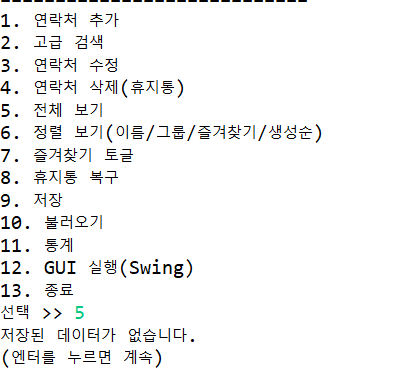

# Eclipse-PhoneBook

Java 콘솔 + Swing GUI 기반 전화번호부 프로젝트입니다.  
입력 검증, 자동 포맷팅, 중복 방지, 휴지통 복구, 파일 저장/불러오기, 통계 기능을 제공합니다.

---

## 1) 개발 환경 (Environment)

- **OS**: Windows 11
- **IDE**: Eclipse IDE (Java)
- **JDK**: Java SE 21
- **Build**: Eclipse 기본 빌드 / `javac`
- **형상관리**: Git + GitHub

---

## 2) 기술 스택 (Tech Stack)

- **Language**: Java
- **UI**: 
  - Console (Scanner 기반 메뉴)
  - Swing (`JFrame`, `JTable`, `DefaultTableModel`)
- **Persistence**:
  - CSV 저장/불러오기
  - JSON Export
  - 백업 파일 생성
- **Etc**:
  - 정규식 기반 입력 검증
  - 데이터 자동 포맷팅(전화번호/생년월일)

---

## 3) 주요 기능

- 연락처 추가 / 검색 / 수정 / 삭제
- 이름/전화번호 중복 방지
- 전화번호 자동 포맷팅
  - `01000000000` → `010-0000-0000`
- 생년월일 자동 포맷팅
  - `19950101` → `1995-01-01`
- 잘못된 형식 입력 시 즉시 재입력 유도
- 즐겨찾기(⭐) 토글
- 휴지통 이동/복구
- 정렬 보기 (`name`, `group`, `favorite`, `created`)
- 통계 출력
- 자동 저장 강화 (핵심 변경 작업 후 즉시 저장)

---

## 4) 프로젝트 구조

```text
src/
 └─ phonebook/
    ├─ PhoneBookApp.java        # Main
    ├─ PhoneBookManager.java    # 핵심 비즈니스 로직
    ├─ PhoneInfo.java           # 연락처 모델
    ├─ MenuViewer.java          # 콘솔 메뉴/입력
    └─ PhoneBookSwingApp.java   # Swing GUI
```

---

## 5) 주요 코드 포인트

### (1) 자동 포맷팅
- `PhoneBookManager.autoFormatPhone()`
- `PhoneBookManager.autoFormatBirth()`

### (2) 입력 검증 + 재입력 루프
- `PhoneBookManager.inputData()`
  - 전화번호/이메일/생년월일 형식 검증
  - 잘못된 값은 즉시 재입력

### (3) 저장 전략
- 수동 저장: 메뉴 `9`
- 종료 저장: 메뉴 `13`
- 자동 저장: 추가/수정/삭제/즐겨찾기/복구 직후 저장

---

## 6) 실행 방법

### Eclipse에서 실행
1. `phonebook` 프로젝트 Import/Open
2. `src/phonebook/PhoneBookApp.java` 실행
3. 콘솔 메뉴로 기능 사용
4. GUI가 필요하면 메뉴에서 `12` 선택

### 커맨드라인 실행 예시
```bash
javac -encoding UTF-8 -d out src/phonebook/*.java
java -cp out phonebook.PhoneBookApp
```

---

## 7) 실행 스크린샷

> 스크린샷은 아래 경로에 추가해두면 README에서 바로 보입니다.

- `docs/screenshots/console-menu.png`
- `docs/screenshots/gui-main.png`




---

## 8) 참고

실행 중 생성되는 데이터 파일(로컬 런타임 데이터)은 `.gitignore`로 관리됩니다.

- `phonebook-data.csv`
- `phonebook-data.json`
- `phonebook-trash.csv`
- `backup/`
